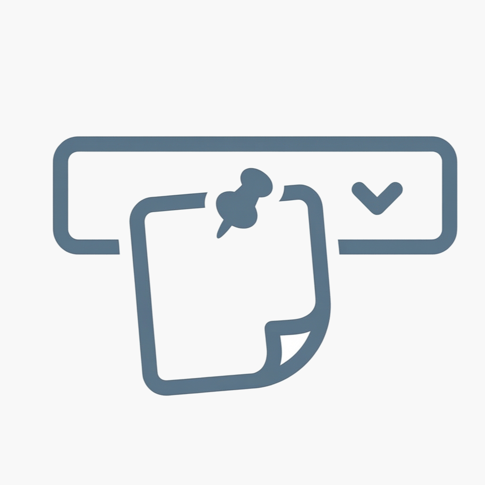

# StayMemo

<p align="center">
  
</p>

macOSのメニューバーに常駐するシンプルなメモアプリです。

## 特徴

- メニューバーのアイコンをクリックで即座に開閉
- 3ページのメモを切り替えて使用
- テキストは即時保存、再起動後も維持
- ピン留め機能で常に最前面に固定
- プレーンテキスト専用（書式付きペーストも自動でプレーン化）
- フォント設定可能（右クリックメニュー → 設定）
- ウィンドウの位置・サイズを記憶
- ローカル完結、ネットワーク不要

## ショートカットキー

| キー | 操作 |
|------|------|
| `⌘1` / `⌘2` / `⌘3` | ページ切り替え |
| `⌘P` | ピン留めのON/OFF |

## 動作環境

- macOS 14 (Sonoma) 以降

## ビルド方法

Xcode GUIは不要です。コマンドラインでビルドできます。

```bash
# デバッグビルド
swift build

# リリースビルド + .appバンドル作成
./build.sh

# 実行
open StayMemo.app
```

## ライセンス

MIT License
